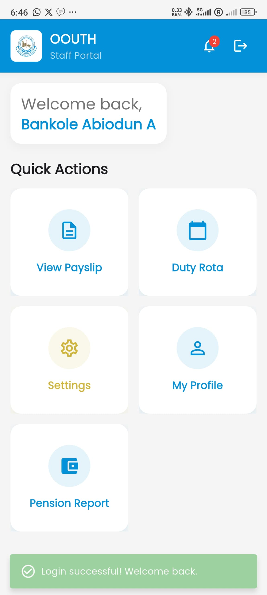
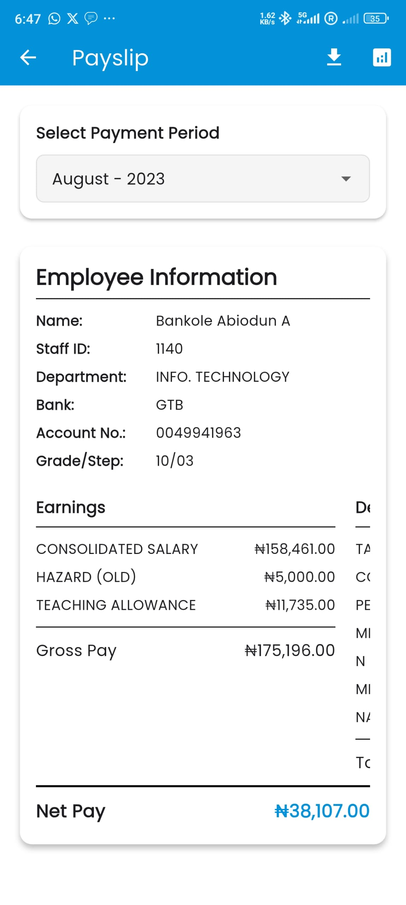
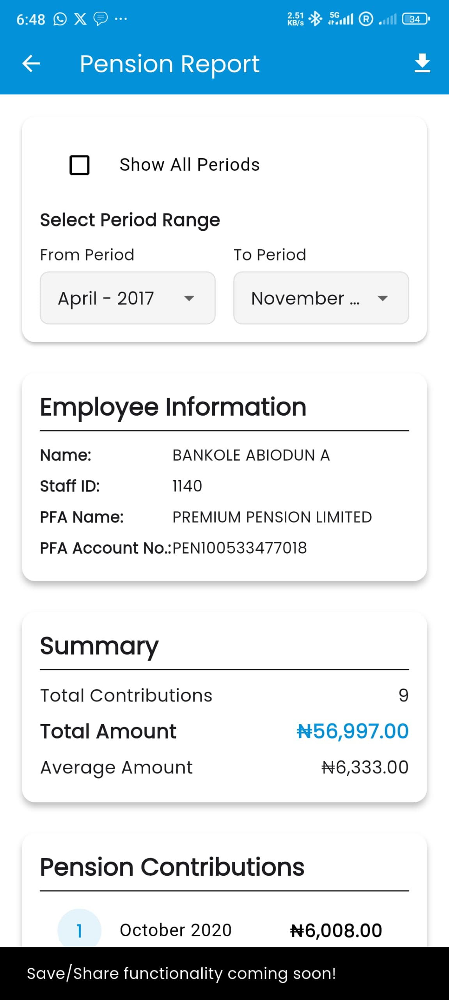

<div align="center">

# OOUTH Staff Management Mobile App

[](https://flutter.dev)
[](https://dart.dev)
[](https://www.android.com)
[](./LICENSE)

**A complete HR & Payroll solution for Olubisi Onabanjo University Teaching Hospital.**
Access payslips, pension reports, and duty rosters on the go.

[**Download APK**](https://oouthsalary.com.ng/download/oouth_mobile.apk) • [**Visit Website**](https://oouthsalary.com.ng/)

</div>

---

## 📱 Features

### Core Features
- **Payslip Management**
  - View payslips for different payment periods
  - Download payslips as PDF
  - Compare payslips across periods
  - Visual analytics with charts and graphs

- **Pension Report** ✨ *New*
  - View pension contribution history
  - Filter by period range or view all periods
  - Download pension reports as PDF
  - Visual contribution trends with charts
  - Summary statistics (total contributions, average amount)

- **Duty Rota**
  - View duty schedules
  - Calendar-based interface
  - Shift management

- **Profile Management**
  - View and edit personal information
  - Update profile details
  - Track approval status

- **Notifications**
  - Real-time notifications
  - Unread count badges
  - Push notifications support

## 📸 App Screenshots

| Dashboard | Payslip View | Pension Report | Duty Rota |
|:---:|:---:|:---:|:---:|
|  |  |  |  |

## 🛠️ Technical Stack

- **Framework**: Flutter 3.32.1
- **Language**: Dart 3.5.4
- **State Management**: Provider
- **HTTP Client**: Dio
- **PDF Generation**: pdf package
- **Charts**: fl_chart
- **Authentication**: JWT-based
- **Storage**: flutter_secure_storage, shared_preferences
- **Biometric Auth**: local_auth

## 📋 Prerequisites

- Flutter SDK 3.32.1 or higher
- Dart SDK 3.5.4 or higher
- Android Studio / Xcode (for mobile development)
- Android SDK 36
- Android NDK 27.0.12077973
- Gradle 8.11.1
- Android Gradle Plugin 8.9.1
- Kotlin 2.1.0

## 🚀 Getting Started

### Installation

1. **Clone the repository**
   ```bash
   git clone https://github.com/meowbanky/OOUTH-Staff-Management-Mobile-App.git
   cd OOUTH-Staff-Management-Mobile-App
   ```

2. **Install dependencies**
   ```bash
   flutter pub get
   ```

3. **Configure Android**
   - Ensure `android/key.properties` exists with keystore configuration
   - Keystore file should be at `android/app/upload-keystore.jks`

4. **Run the app**
   ```bash
   flutter run
   ```

## 📦 Building the App

### Build Release APK

Use the automated build script:

```bash
cd oouthsalary_mobile
./version_bump.sh
```

The script will:
1. Prompt for version bump type (Major/Minor/Patch)
2. Update version in `pubspec.yaml`
3. Create `version.json` files
4. Build release APK files (split per architecture + universal)
5. Copy APKs to `oouthsalary/download/` folder
6. Generate version information for download page

### Manual Build

```bash
# Build universal APK
flutter build apk --release

# Build split APKs (smaller file sizes)
flutter build apk --split-per-abi --release
```

### Build Locations

- Universal APK: `build/app/outputs/flutter-apk/app-release.apk`
- ARM64: `build/app/outputs/flutter-apk/app-arm64-v8a-release.apk`
- ARMv7: `build/app/outputs/flutter-apk/app-armeabi-v7a-release.apk`
- x86_64: `build/app/outputs/flutter-apk/app-x86_64-release.apk`

## 🌐 API Endpoints

The app connects to: `https://oouthsalary.com.ng/auth_api`

### Authentication
- `POST /api/auth/login.php` - User login
- `POST /api/auth/reset_password.php` - Password reset
- `GET /api/auth/get_employee.php` - Get employee details

### Payroll
- `GET /api/payroll/periods.php` - Get payment periods
- `GET /api/payroll/payslip.php` - Get payslip data
- `GET /api/payroll/pension_report.php` - Get pension report data ✨ *New*

### Profile
- `GET /api/profile/get_profile.php` - Get profile
- `POST /api/profile/submit_changes.php` - Submit profile changes
- `GET /api/profile/get_approval_status.php` - Get approval status

### Other
- `GET /api/departments/get_departments.php` - Get departments
- `GET /api/duty/duty_rota.php` - Get duty rota
- `GET /api/auth/notifications.php` - Get notifications

## 📁 Project Structure

```
oouthsalary_mobile/
├── lib/
│   ├── main.dart                 # App entry point
│   ├── models/                   # Data models
│   ├── screens/                  # UI screens
│   │   ├── dashboard_screen.dart
│   │   ├── payslip_screen.dart
│   │   ├── pension_report_screen.dart  # ✨ New
│   │   └── ...
│   ├── services/                 # API services
│   │   ├── api_service.dart
│   │   ├── payslip_service.dart
│   │   ├── pension_service.dart  # ✨ New
│   │   └── ...
│   ├── providers/                # State management
│   ├── widgets/                  # Reusable widgets
│   └── utils/                    # Utilities
├── android/                      # Android configuration
├── ios/                          # iOS configuration
├── assets/                       # Images, fonts, etc.
├── version_bump.sh              # Build & deployment script
└── version.json                 # Version information
```

## 🔐 Security

- JWT token-based authentication
- Secure storage for sensitive data
- Biometric authentication support
- Encrypted API communications

## 📱 Download

The app can be downloaded from:
- **Download Page**: https://oouthsalary.com.ng/download.html
- **Direct APK**: https://oouthsalary.com.ng/download/oouth_mobile.apk

Version information is available at:
- `https://oouthsalary.com.ng/download/version.json`
- `https://oouthsalary.com.ng/download/version.php`

## 🚀 Deployment

### Automated Deployment

1. **Update version**
   ```bash
   ./version_bump.sh
   ```
   Select version bump type when prompted.

2. **Files are automatically:**
   - Built as release APKs
   - Copied to `oouthsalary/download/` folder
   - Version info updated in `version.json`

3. **Upload to server**
   - Upload APK files to web server
   - Ensure `download.html` is accessible
   - Verify version.json is accessible

### Manual Deployment

1. Build APK: `flutter build apk --release`
2. Copy APK to `oouthsalary/download/oouth_mobile.apk`
3. Update `oouthsalary/download/version.json`
4. Upload files to server

## 📊 Version Information

Current version: **1.1.0+2**

Version format: `MAJOR.MINOR.PATCH+BUILD_NUMBER`

- **Major**: Breaking changes
- **Minor**: New features
- **Patch**: Bug fixes
- **Build**: Incremental build number

## 🐛 Troubleshooting

### Build Issues

**Gradle/Kotlin errors:**
```bash
cd android
./gradlew clean
./gradlew --stop
cd ..
flutter clean
flutter pub get
```

**NDK version mismatch:**
- Ensure Android NDK 27.0.12077973 is installed
- Update `android/app/build.gradle` with correct NDK version

**Signing errors:**
- Verify `android/key.properties` exists
- Check keystore file path in `build.gradle`
- Ensure keystore file is at `android/app/upload-keystore.jks`

### Runtime Issues

**PDF generation blank:**
- Check console logs for pension data structure
- Verify API returns data in expected format
- Ensure pension data is not empty

**API connection errors:**
- Verify base URL: `https://oouthsalary.com.ng/auth_api`
- Check network connectivity
- Verify JWT token is valid

## 📝 Changelog

### Version 1.1.0 (Current)
- ✨ Added pension report feature
- 📊 Pension contribution history with charts
- 📄 PDF export for pension reports
- 🔧 Improved error handling
- 🐛 Fixed PDF generation issues
- 📱 Updated download page
- 🔧 Updated Android build configuration (SDK 36, NDK 27, Gradle 8.11.1)

### Version 1.0.0
- 🎉 Initial release
- 📄 Payslip viewing and download
- 👤 Profile management
- 📅 Duty rota access
- 🔔 Notifications

## 👥 Contributing

1. Create a feature branch
2. Make your changes
3. Test thoroughly
4. Submit a pull request

## 📄 License

Copyright © OOUTH Salary Management System. All rights reserved.

## 📞 Support

For issues or questions:
- Check the troubleshooting section
- Review API documentation
- Contact the development team

---

**Built with ❤️ for OOUTH Staff**
